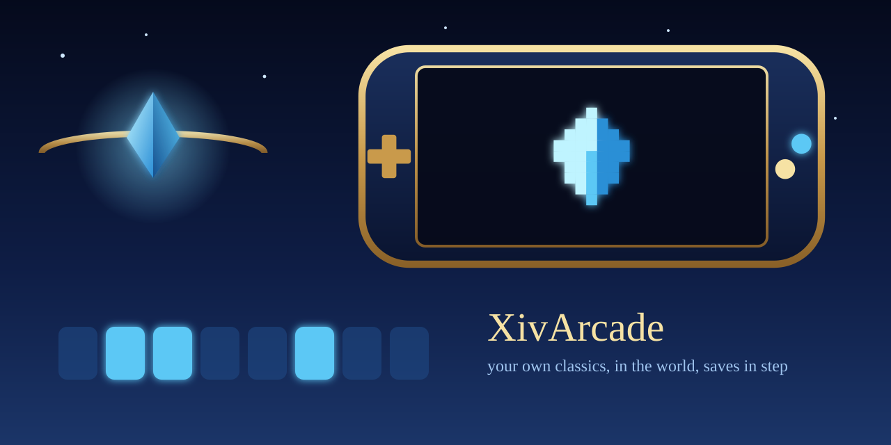

# XivArcade

<p align="center">
  <picture>
    <source media="(prefers-color-scheme: dark)" srcset="images/readme/hero-dark.png">
    <source media="(prefers-color-scheme: light)" srcset="images/readme/hero-light.png">
    
  </picture>
</p>


**Your own classic games inside FINAL FANTASY XIV, with every save kept in step across your machines.**

XivArcade is a Dalamud plugin for the game running under Wine on Linux. `/arcade` lists the game
files in folders **you** choose, Final Fantasy first, starts them in RetroArch on the Linux host, and,
when [Ghostty for Dalamud](https://github.com/Spaceghost/ghostty-dalamud) and its host agent are
running, shows them as panels in the world. Every battery save and save state lives in one folder
that Syncthing copies between your machines.

> **Bring your own games.** XivArcade never downloads, links to or helps find ROMs, disc images, BIOS
> files or artwork. It only reads folders you point it at. Use your own dumps of games you own.

> **Status: experimental, not verified in game.** Host tests cover the library, LaunchBox import,
> playlists, the emulator command per core, name matching, the save-sync state machine and the IPC
> payloads, using empty placeholder files. No emulator, controller, in-game window or two-machine sync
> has been observed. What follows is implemented intent and checks to perform, not observed results.

[Requirements](#requirements) · [Install](#install-from-the-plugin-repository) ·
[First run](#first-run) · [Commands](#commands) · [Save sync](#save-sync) ·
[Full guide](docs/ARCADE.md)

## What you get

- A box-art wall in the shared dark-ink, gold and glass style: your own covers in a grid by shelf, the
  selected one glowing, a details strip with Play. Type to search, arrows or D-pad, Enter to play, Tab
  changes shelf.
- Covers are your own files (`<console>/covers/<game name>.png`, `cover.png` in a game's folder, or
  LaunchBox `Images/`); a game without one gets a drawn cover in its console's box shape. Nothing is
  downloaded. See [docs/ARCADE.md](docs/ARCADE.md#covers).
- A three-step first run whose checks turn green by themselves, each with one command to copy.
- A 26-title Final Fantasy shelf of drawn covers that light up as your files appear.
- LaunchBox libraries copied in as they are: platform folders, `Data/Platforms/*.xml`, `Images/`.
- Multi-disc games as one entry (`.m3u` written outside your games folder).
- One synced save tree, file versioning on; a game never starts while its saves are still arriving, a
  conflict keeps both saves with the newer one live, and an older save never replaces a newer one.
- SQLite for the library, play history and sync state.

## How it fits together

```
FFXIV (Wine)                         Linux host
  XivArcade.dll  ── writes ──▶  ~/.config/xiv-arcade/xiv-arcade      (the helper, Python, stdlib only)
      │  reads state.json ◀──   ~/.config/xiv-arcade/state.json, arcade.db
      └─ asks ghostty-dalamud (IPC, optional) to run the helper inside the agent's compositor
                                      └─ helper: sync gate → RetroArch → sync again
```

The plugin holds no game or save logic; the helper does, and it runs without the game
(`tools/xiv-arcade`). XivArcade references neither ghostty-dalamud nor XivDesktop. **Without
ghostty-dalamud** the window says so plainly: the library, setup and save sync still work (the helper
is started through Wine's `start /unix`), and you may tick *Play on the Linux desktop instead*, which
opens the emulator outside FFXIV rather than as a panel. That path cannot work where the launcher's
sandbox hides the host.

## Requirements

- FFXIV under Wine on Linux with Dalamud (API 15), Python 3.9+ on the host.
- RetroArch (`org.libretro.RetroArch` from Flathub, or a native `retroarch`) and a core per console.
  The window shows the one install line and names the cores. Nothing is installed for you.
- Optional: ghostty-dalamud + its host agent (games as panels); Syncthing (save sync).

## Install (from the plugin repository)

```text
https://spacegho.st/mods/ffxiv/plugins.json
```

1. `/xlsettings` → **Experimental** → **Custom Plugin Repositories**: add the URL, **+**, save.
2. `/xlplugins` → **All Plugins**: search **XivArcade**. There is no release yet; until there is,
   use the dev-plugin route below.

## Install (dev plugin)

```sh
git clone https://github.com/Spaceghost/xivarcade-dalamud.git
cd xivarcade-dalamud
tools/fetch-dalamud.sh && tools/install-dev.sh
```

`tools/install-dev.sh` builds Release and stages the plugin beside the checkout at
`../xiv-arcade-build/devplugin/`, then prints the Wine path. Add it under `/xlsettings` →
**Experimental** → **Dev Plugin Locations**, then enable **XivArcade** under `/xlplugins` → **Dev Tools**.
The script does not edit Dalamud's configuration. `XIVARCADE_ARTIFACTS` and `XIVARCADE_STAGE` override
the output folders.

## First run

`/arcade` creates `~/Games/Arcade/<console>/` (a README in each naming the accepted files), the save
tree and the database, then shows three steps: choose your games folder, install the emulator, drop
your own game files in. New files appear by themselves while the window is open. Coming from
LaunchBox: copy the folder in, or `/arcade launchbox /path/to/LaunchBox`.

## Commands

| Command | What it does |
| --- | --- |
| `/arcade` | Opens the library (the welcome, when there are no games). |
| `/arcade <name>` | Plays the closest match: `/arcade ff7`, `/arcade tactics`, `/arcade x-2`. |
| `/arcade last` · `list` · `rescan` | Resume the most recent game · print the library · look again. |
| `/arcade sync` · `setup` | Force a save sync and show its status · the first-run checklist. |
| `/arcade launchbox <folder>` | Read a LaunchBox folder where it lives. |
| `/arcade import-saves <folder>` | Copy saves from another RetroArch install, never over a newer save. |
| `/arcade launch --dry-run <name or file>` | Print the exact emulator command and start nothing. |

In the window: type to search, arrows or D-pad move, Enter plays, Tab changes shelf, F5 rescans, F6 syncs, Esc closes.

## Save sync

Saves and states live in `~/.local/share/xiv-arcade/sync/{saves,states}/<console>/`. XivArcade does not
install or start Syncthing, enable a service or pair a device; it prints the commands
(`xiv-arcade sync-setup`, `xiv-arcade pair`). The statuses, the launch rule and how conflicts are
resolved are in [docs/ARCADE.md](docs/ARCADE.md#save-sync).

## For other plugins

Two IPC functions, no assembly reference needed:

| Name | Signature | Meaning |
| --- | --- | --- |
| `XivArcade.v1.Search` | `string query → string` | JSON `[{"id","title","subtitle","ready","score"}]`, best first, at most 20; empty query → `[]`. |
| `XivArcade.v1.Launch` | `string id → string` | `"ok: …"` or `"error: …"`; an empty id opens the window. |

## Known limits

The first release's four limits, and where each stands (details in [docs/ARCADE.md](docs/ARCADE.md)).
None of this has been seen working in the game yet.

- **Controller: addressed, unverified in game.** While an arcade game's panel has the focus, a hook on
  the game's gamepad poll hides the pad from FFXIV, with a banner for as long as it lasts. Hold
  Start+Select for a second, press Esc or type `/arcade pad off` to take it back; it also lets go on
  combat, cutscenes, zone changes, logout, when the game closes or its panel loses focus, and on
  unload. If the hook cannot be installed, FFXIV is left alone and the window says so. It only ever
  withholds your own input. What remains: whether RetroArch ignores the pad while *its* panel is not
  focused is untested.
- **PlayStation 2: standalone PCSX2** (Flatpak or native) is an option beside the LRPS2 core, and
  DuckStation beside the PlayStation cores, with a preferred emulator per console or per game. Their
  saves go into the synced tree through a generated profile; your own emulator settings are not
  edited. PPSSPP and melonDS standalones are not wired up.
- **BIOS: bring your own, without the guesswork.** Exact file names, sizes, MD5s and the folder, a
  check that turns green when a correct dump appears, and a clear message for a wrong one. PlayStation
  games can start without a BIOS on PCSX ReARMed ("no BIOS needed, lower compatibility").
  PlayStation 2 always needs one. XivArcade never downloads, links to or helps find a BIOS.
- **Paths:** `XDG_*` directories, Flatpak and native RetroArch locations, a custom games folder and a
  custom saves folder are honoured, and the Wine-to-Linux mapping is derived instead of assuming `Z:`.
  An existing setup is never moved unless you ask.

## Privacy and security

XivArcade talks to nothing on the network. The helper's only URL is Syncthing's API on localhost.
Device names and IDs live only in your own `~/.config/xiv-arcade/` and Syncthing's config.

## Development

```sh
python3 -B -m unittest discover -s tests/arcade     # the helper; placeholder files only
tools/fetch-dalamud.sh                               # Dalamud reference assemblies
dotnet test tests/XivArcade.Core.Tests -c Release
dotnet build src/XivArcade.Plugin/XivArcade.Plugin.csproj -c Release && tools/package.sh
```

`master` is the only branch. Every user-visible change edits `changelog.json`
(`tools/changelog.py` renders `CHANGELOG.md`); statuses mean: `new`/`fix` seen working in game, `beta`
merged but not verified in game, `next` still being built. Releasing: [docs/RELEASING.md](docs/RELEASING.md).
